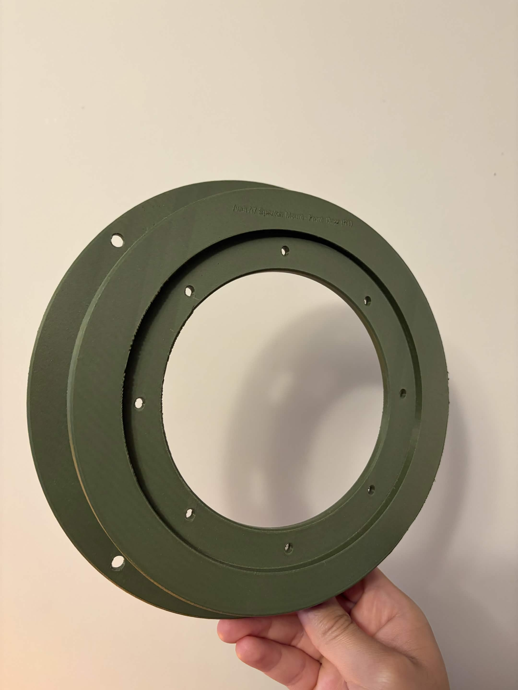
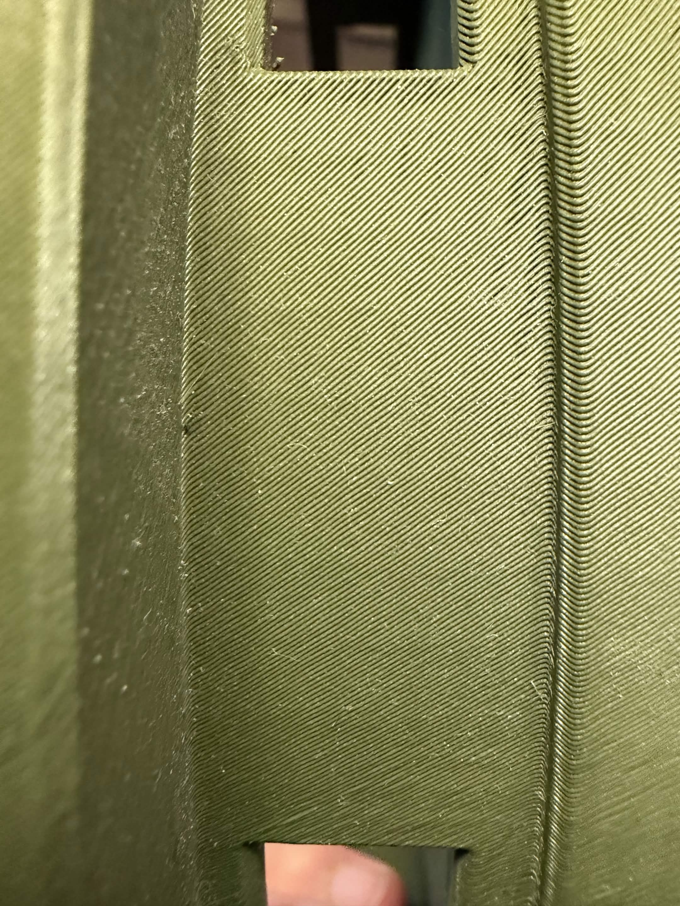

# Reconstructed Audi A7 Speaker Bracket

## Overview

Designed and manufactured a custom speaker mounting bracket for a 2012 Audi A7 to enable installation of aftermarket speakers where no commercially available mounting solution existed.

## Problem

The factory speaker mounting geometry was incompatible with the aftermarket speakers being installed. No off-the-shelf adapter bracket was available, requiring a custom solution that maintained proper speaker alignment while fitting within the constraints of the factory door assembly.

## Challenges

One challenge was ensuring dimensional accuracy without access to OEM drawings. Measurements had to be obtained directly from the vehicle and verified through multiple design iterations, and test fits before arriving at the final geometry.

Another challenge involved the anisotropic nature of FDM 3D-printed components. Due to the layer-by-layer manufacturing process, printed parts are generally weaker along layer boundaries than within individual layers.
When installed, the speaker assembly applied loading that would have introduced significant shear stresses across the printed layer interfaces if the bracket had been manufactured in its original orientation. This created a potential failure mode where the bracket could delaminate over time due to vibration and operational loading.
To mitigate this risk, the print orientation was redesigned so that the primary load path aligned more favorably with the layer structure. By rotating the part before manufacturing, the critical stresses acted predominantly within the layers rather than across them, significantly improving the structural integrity of the final component.
This modification allowed the bracket to withstand long-term service conditions, including continuous vibration and Alberta's extreme seasonal temperature variations.

## Solution

Reverse-engineered the factory mounting interface through measurement and inspection, then designed a custom bracket using CAD software. Multiple design iterations were evaluated to ensure proper fitment, structural integrity, and ease of installation. The final design was manufactured using 3D printing and successfully integrated into the vehicle.

## Design Considerations

- Factory mounting locations and geometry
- Speaker alignment and depth clearance
- Structural rigidity
- Vibration resistance
- Material selection for automotive use
- Ease of installation and serviceability
- Manufacturing constraints associated with 3D printing

## Tools & Technologies

- FreeCAD
- 3D Printing
- PETG Prototype Manufacturing
- Dimensional Measurement
- Reverse Engineering
- Mechanical Design

## Skills Demonstrated

- CAD Design
- Reverse Engineering
- Design for Manufacturing (DFM)
- Rapid Prototyping
- Mechanical Design
- Problem Solving
- Iterative Design Process

## Outcome

Successfully designed, manufactured, and deployed a custom speaker mounting bracket that enabled aftermarket speaker integration without permanent vehicle modifications. The brackets have remained installed and fully functional for over one year, enduring vehicle vibration and Alberta's extreme temperature fluctuations without structural degradation, fitment issues, or failure.

## Photos

### CAD Model

### Prototype

### Layering

