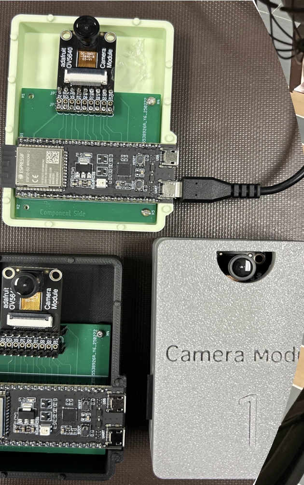
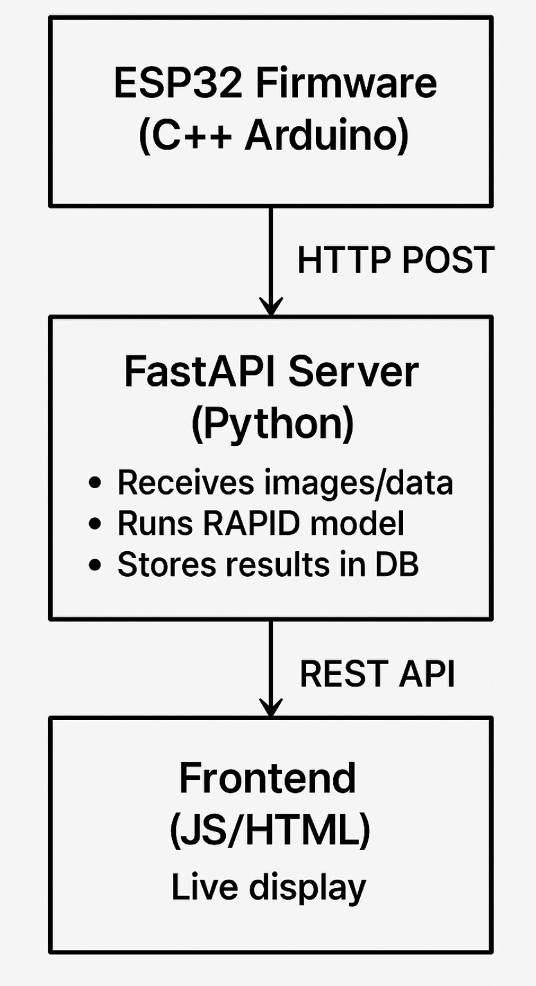
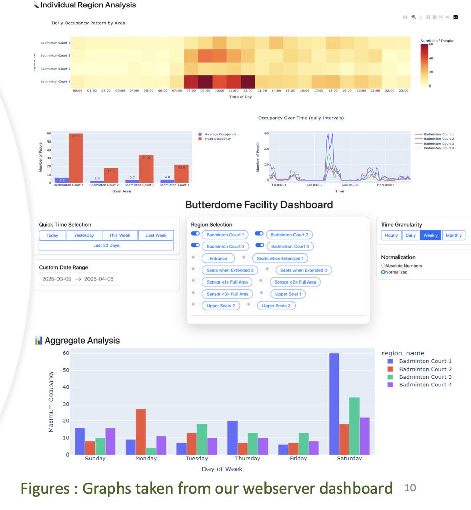

# Butterdome Occupancy Monitoring System

## Overview

Designed and deployed a smart occupancy monitoring platform for the University of Alberta's Van Vliet Complex (Butterdome) to provide real-time and historical facility utilization data.

The system combines embedded camera nodes, Time-of-Flight sensors, computer vision, long-range wireless communication, database storage, and web-based analytics to help facility managers optimize space allocation and scheduling.

---

## Problem

The Butterdome contains multiple recreational spaces that experience varying levels of utilization throughout the day. Facility staff lacked an automated method of measuring actual occupancy and comparing it against scheduled bookings.

This limited their ability to:

- Identify underutilized spaces
- Optimize facility scheduling
- Evaluate demand trends
- Improve allocation of recreational resources

---

## Solution

A multi-sensor occupancy monitoring platform was developed using:

- ESP32-S3 camera nodes
- OV5640 camera modules
- Time-of-Flight occupancy sensors
- LoRa wireless communication
- FastAPI backend services
- PostgreSQL database storage
- Web-based dashboards

The system continuously collects occupancy information, stores historical records, and provides visualization tools for facility managers.

---

## System Architecture

### Data Flow

1. Camera and ToF sensor nodes collect occupancy information.
2. Data is transmitted through WiFi or LoRa.
3. FastAPI backend receives and processes data.
4. Occupancy information is stored in PostgreSQL.
5. Dashboard provides real-time and historical analytics.

---

## Camera-Based Occupancy Detection

### Hardware

- ESP32-S3 DevKitC
- OV5640 5MP Camera
- WiFi Communication

### Deployment

Camera modules were mounted approximately 15 meters above the Butterdome courts using existing catwalk infrastructure.

Each camera monitored approximately 400 m² of floor space.

### Image Processing

Images were captured every 30 seconds and transmitted to the backend server using HTTP POST requests.

Occupancy was determined using the RAPiD (Rotation-Aware People Detection) model optimized for overhead fisheye camera views.

---

## Time-of-Flight Occupancy Sensors

### Hardware

- VL53L8CX Time-of-Flight Sensor
- Wio-E5 LoRa Microcontroller
- LoRa Receiver Gateway

### Purpose

Studio spaces required a privacy-preserving solution that could detect entries and exits without capturing images.

The ToF sensors monitored distance changes and used multi-zone ranging to determine movement direction and occupancy counts.

### Communication

Sensor data was transmitted using LoRa to a local gateway and forwarded to the backend database.

---

## Software Architecture

### Embedded Firmware

#### ESP32 Camera Nodes

- Written in C++ (Arduino Framework)
- Image capture
- HTTP data upload
- WiFi management
- Remote configuration

#### Wio-E5 Sensor Nodes

- Low-power operation
- Interrupt-driven ranging
- Adaptive sampling frequency
- LoRa transmission

### Backend

- Python
- FastAPI
- OpenCV
- RAPiD Detection Model

Responsibilities:

- Image processing
- Occupancy detection
- Data aggregation
- Database management
- REST API services

### Database

- PostgreSQL

Stored:

- Occupancy counts
- Historical trends
- Sensor logs
- Region configurations

### Frontend Dashboard

Features included:

- Real-time occupancy monitoring
- Historical trend analysis
- Heatmaps
- Peak utilization metrics
- Region filtering
- Zone configuration tools

---

## Engineering Challenges

### Privacy-Conscious Occupancy Monitoring

A key challenge was developing an occupancy monitoring solution that respected user privacy.

To address this, cameras were mounted at high elevations and only used for overhead occupancy counting. Images were processed automatically and were not intended for identifying individuals.

### Multiple Sensor Technologies

Different spaces require different sensing approaches.

Large open recreational areas were best monitored using computer vision, while smaller studios benefited from Time-of-Flight sensors that required lower bandwidth and improved privacy.

### Detection Zone Mapping

The Butterdome contains multiple activity zones within a single camera view.

A configurable zone-mapping system was developed that allowed facility staff to define occupancy regions through the web dashboard without modifying firmware.

### System Scalability

The architecture was designed to support multiple camera nodes and sensor nodes operating simultaneously while storing data in a centralized database.

---

## Results

The final system successfully provided:

- Real-time occupancy monitoring
- Historical utilization analysis
- Automated people counting
- Zone-specific activity tracking
- Facility-wide analytics dashboards

The project demonstrated successful integration of embedded systems, computer vision, backend software, networking, and data visualization into a single deployed platform.

---

## Skills Demonstrated

- Embedded Systems
- ESP32 Development
- IoT Systems
- Computer Vision
- Python
- FastAPI
- PostgreSQL
- REST APIs
- Wireless Networking
- LoRa Communication
- OpenCV
- Data Analytics
- Dashboard Development
- System Integration

---
